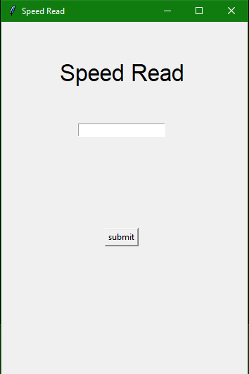
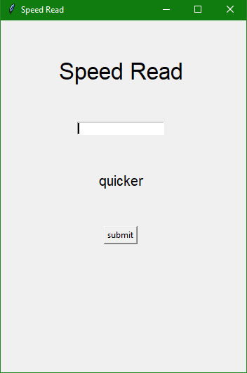
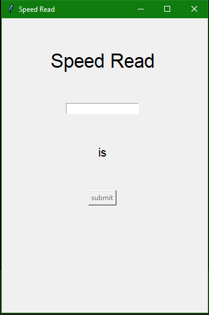

# Speed Read

## Overview
Program that takes a string and outputs it as single words on the screen allowing the user to read quicker.

This project was started when I found out that reading speeds can be dramatically increased when reading with this method however, I later found out that it can worsen comprehension.

Made in Python using the tkinter module.

## Instructions
- Paste a string into the text input box and click the enter button.

- Words are then displayed one by one in a quick method allowing the reader to read sentences quicker.

# Screenshots

